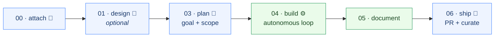
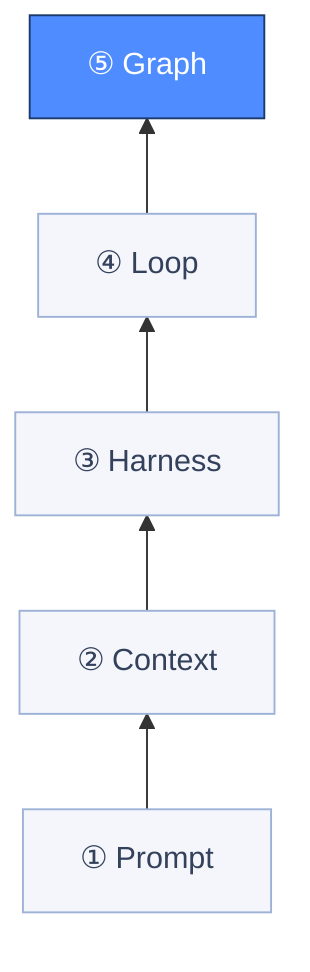
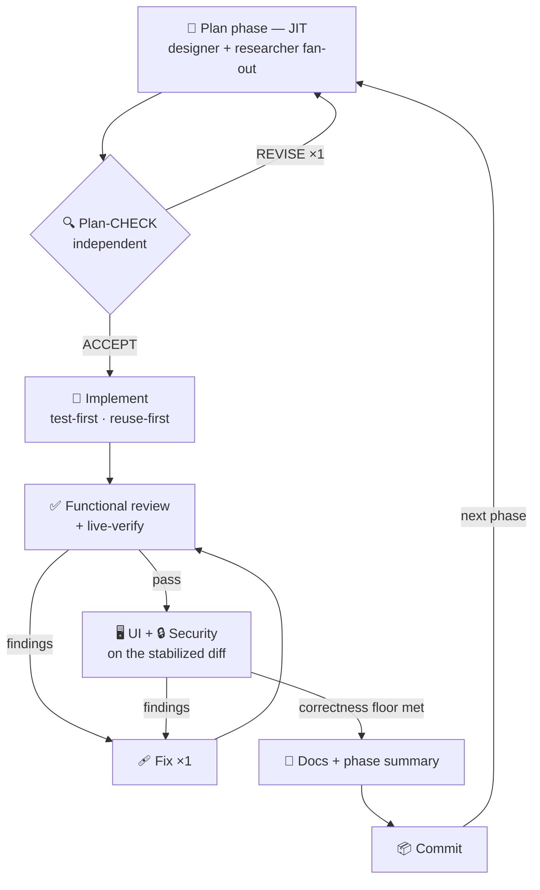

<div align="center">

# DevExpert

### Lazy Development, engineered.

**A file-native, _graph-engineered_ SDLC for Claude Code.** Hand it a goal — an Opus orchestrator plans, builds (TDD), reviews, documents, and ships through a graph of specialized agents. **You gate only direction, scope, and release. It does the rest, and never ships broken.**

<br/>

[](https://robensive.in)
[](#-license)
[](CHANGELOG.md)
[](#-requirements)
[](#-compatibility)

**[Install](#-installation) · [Lazy Development](#-lazy-development) · [The Ladder](#-the-engineering-ladder) · [Quick Start](#-quick-start) · [How It Works](#-how-it-works) · [Architecture](ARCHITECTURE.md)**

<sub>DevExpert ships as the <code>devx</code> plugin for Claude Code — every command is <code>/devx:…</code></sub>

</div>

---

> [!NOTE]
> **Most AI coding agents are a _loop_** — one model grinding on one context until it stops, reviewing its own work in the same window that wrote it. **DevExpert is the _graph_:** many specialized agents, each in a clean context, wired by explicit gates and routes — with **independent review** and a **correctness floor** standing between every change and your branch.

<div align="center">



<sub>🚪 = you decide · ⚙️ = fully autonomous</sub>

</div>

---

## 🧘 Lazy Development

**Lazy Development isn't doing less — it's deciding more and typing less.**

The best engineers are strategically lazy: they automate the toil and spend their attention only where judgment actually pays. DevExpert is that philosophy, shipped.

You stay **lazy about the _how_** — implementation, test loops, code review, docs, commits, PRs, resume-after-a-crash. You stay **ruthless about the _what_** — direction, scope, and the quality bar. DevExpert runs everything between your gates autonomously and **refuses to commit a phase that fails its checks.**

> [!TIP]
> Lazy, not reckless. Autonomy here is **bounded**: the operator-approved roadmap is the only stop condition, one bounded fix pass replaces infinite retries, and a **correctness floor** gates *you* the moment something can't be made to pass. You're never watching it grind — you're just deciding at the moments that matter.

---

## 🪜 The Engineering Ladder

The field keeps renaming the outer layer of agent design: **prompt → context → harness → loop → graph.** Most tools engineer one or two rungs and stop. **DevExpert engineers all five** — and the graph is where the leverage compounds.

<div align="center">



<sub>Most agents stop at ④ Loop. DevExpert climbs to ⑤ Graph — framework-free.</sub>

</div>

| Layer | What it engineers | How DevExpert does it |
|-------|-------------------|-----------------------|
| **① Prompt** | the words in a single model call | Strict, single-sourced agent templates (persona → forced reads → steps → rules) — written once in `references/`, never restated |
| **② Context** | what each model actually sees | **Files are the brain.** Every sub-agent starts fresh; the orchestrator passes *paths, not contents*; `kb_search` pulls only what's relevant. No bloated window |
| **③ Harness** | the tools & environment to act in | Native `Bash/Edit/Write/Read/Grep/Glob` + a lean `devx` CLI + hooks + **live-verify** (actually runs the app) |
| **④ Loop** | one agent's build-verify cycle | The per-phase loop and a **bounded** fix loop — capped, never infinite |
| **⑤ Graph** | the topology of the whole system | An **Opus orchestrator** routing specialized agents and deterministic gates: fan-out/fan-in, conditional routes, `PROPOSE → MAKE → CHECK → FIX` |

> [!IMPORTANT]
> **Graph-engineered, framework-free.** DevExpert is an explicit execution graph — agents and gates are *nodes*, stage/risk/verdict routes are *edges*, `.devx/` files are the durable *state* — with **no** graph runtime, workflow engine, or agent-swarm dependency to install. It's inspectable, commit-friendly, and resumable with nothing but your repo.

---

## ✨ Why DevExpert

- 🧠 **One Opus brain, many cheap hands.** A single long-lived orchestrator reasons and dispatches; **Sonnet** makes, **Haiku** does plumbing. Model *aliases* mean it rides your host's current generation — no pinned versions.
- 🔒 **Independent review is the quality engine.** A separate reviewer in a **clean context** scores each phase against **pre-committed, executable criteria** — the anti-flattery rail. Self-approval is structurally impossible.
- 🚧 **Never ships broken.** A **correctness floor** halts autonomy on any unmet criterion, failing live-verify, blocking review, or surviving Critical/High vuln — and the sole git committer *refuses* to commit a failed-gate phase.
- 📄 **Crash-proof by design.** Continuity lives in `.devx/` Markdown, not chat history. Runs survive crashes, hop machines, and resume from a fresh clone — **losslessly.** Reset beats compaction.
- ⚡ **Just-in-time planning + safe parallelism.** Each phase is planned right before it's built and **independently plan-CHECKed**. Independent work fans out; results fan in only when every pre-allocated handoff validates.
- 📚 **It compounds.** Per-phase research and learnings are FTS5-indexed, so a lesson one phase learns **ranks** for the next — and ship-time curation feeds a shared, cross-project knowledge vault through a validation gate.

---

## 📦 Installation

**Prerequisites:** [Claude Code](https://claude.com/claude-code) plus the [required tools](#-requirements) — `python 3.11+`, `git`, `ripgrep`.

**Option A — from a local clone** *(quickest; ideal for trying it out or hacking on it)*

```bash
git clone https://github.com/RikunjSindhwad/DevX.git
claude --plugin-dir ./DevX          # point Claude Code at the plugin root
```

`--plugin-dir` loads the plugin for that session; the directory you pass must contain `.claude-plugin/plugin.json`. Iterating on the plugin? Run `/reload-plugins` in-session to pick up edits without restarting.

**Option B — install from the marketplace** *(for everyday use)*

```text
/plugin marketplace add RikunjSindhwad/DevX
/plugin install devx@robensive
```

**Verify it loaded:** `/plugin list` shows the plugin, and `/help` lists the namespaced `/devx:*` commands.

---

## 🚀 Quick Start

DevExpert ships **four skills**, all namespaced `/devx:` (canonical, and unambiguous even if another plugin ships the same short name):

| Command | What it does |
|---------|--------------|
| **`/devx:devx`** | The orchestrator — attach to the repo, then start or resume a workstream through the full design → plan → build → review → document → ship pipeline |
| **`/devx:devx-init`** | Optional one-time bootstrap — check/install tools, build indexes, scaffold `.devx/` |
| **`/devx:devx-explain`** | Read-only — cited Q&A over the codebase, or generate per-component docs |
| **`/devx:devx-vault`** | Grow the knowledge vault — paste content or research a topic |

```text
/devx:devx-init                 # one-time bootstrap: check/install tools, build indexes, scaffold .devx/
/devx:devx                      # attach to the current repo; start or resume a workstream
/devx:devx add OAuth login      # attach with an initial goal
/devx:devx-explain              # read-only: understand the codebase, or generate per-component docs
/devx:devx-vault                # add to the knowledge vault: paste content, or research a topic
```

> [!TIP]
> `/devx:devx` is **self-sufficient** — it scaffolds `.devx/`, initializes git if absent, scouts the repo, picks a VCS mode, and starts or resumes. `/devx:devx-init` is an *optional* accelerator that pre-installs tools and pre-builds indexes.

---

## 🔭 How It Works

DevExpert runs a **6-stage pipeline** (`stages/00..06`), loading each stage one at a time to stay lean and pausing only at a few operator gates. Between gates, it's autonomous — that's where "hands-off" lives.

| Stage | What happens | Operator gate |
|-------|--------------|:-------------:|
| **00 · attach** | Locate/create `.devx/`, set git exclusions, scout the repo, start vs. resume | Workstream + mode |
| **01 · design** *(optional)* | Brainstorm stack/tradeoffs → `decisions.md`; architect structure → `architecture.md` | Direction / architecture |
| **03 · plan** | Brief + architecture → `goal.md` (north star) + `roadmap.md` (one line per phase) | **Goal & scope** |
| **04 · build** | The autonomous per-phase loop *(below)* | *only on scope change or floor* |
| **05 · document** | Final coherence pass | — |
| **06 · ship** | Branch / clean commits / PR + vault curation | **Ship + curate** |

### The per-phase build loop

Each roadmap phase is a full mini-lifecycle. Planning is **just-in-time**, verification is **sequenced and independent**, and the loop can only stop where the operator-approved roadmap says to.

<div align="center">



</div>

Every substantive step runs the **`PROPOSE → MAKE → CHECK → FIX`** model policy:

- **PROPOSE / DESIGN** *(Opus)* — reasons and directs; writes only `.devx/` judgment artifacts, never product source.
- **MAKE** *(Sonnet)* — writes the code, tests, and docs.
- **CHECK** *(Opus / Sonnet, independent)* — a fresh context judges the output against pre-committed criteria; it never sees the PROPOSE rationale, so it can't grade its own plan.
- **FIX** *(Sonnet)* — one bounded pass per rejected return; if the floor still isn't met, you're gated.

*Optional external second opinion:* when evidence materially conflicts or a diff is high-blast-radius, the orchestrator may request permission for a single inline, read-only **Codex** review (roadmap/code/security) — off by default, operator-gated, and purely advisory. A *different model* raising flags; every retained claim still returns through DevExpert's own verifiers.

---

## 📂 What It Creates in Your Repo

Everything is Markdown a human can open. `.devx/` is **committed and team-visible**; only derived/rebuildable dirs are git-ignored.

<details>
<summary><b>Expand the <code>.devx/</code> layout</b></summary>

```
.devx/                     # shared, committed (only cache/, index/, .venv/ are git-ignored)
  project.md  log.md  decisions.md  architecture.md  learnings.md  learnings-index.md
  backlog.md               # human intake: bugs/improvements the operator drops in
  workstreams/<slug>/
    brief.md  goal.md  roadmap.md  roadmap-check.md   # north star + independently checked phase map
    state.md  security-ship.md  handoffs/             # optional codex-*-review.md when operator approves
    research/                          # optional pre-roadmap spikes
    phases/<NN>-<slug>/                # per-phase: plan.md plan-check.md research/ review.md gui.md security.md summary.md
  ui-gallery/<phase>/      # committed per-view UI screenshots (the visual acceptance record)
  index/                   # derived FTS5 indexes (git-ignored, rebuildable)
  cache/                   # fetch cache (git-ignored)
```

</details>

Resume reads these files — never chat history. Append-only logs use `merge=union`, and shipping is **idempotent**: an existing open PR is resumed, a closed/merged one returns to you, so an interrupted run never duplicates work.

---

## 🧠 The Knowledge Vault

`vault/` is curated, project-agnostic SWE knowledge (testing, security, patterns, packages, …), **FTS5-indexed** for `devx kb_search`. Entries carry YAML frontmatter (`id`, `title`, `tags`, `related`, …) and cross-link via `related:` / `[[wikilinks]]`, which `devx index` records as a link graph.

- **Two indexes** — the cross-project vault, and a per-project index over durable `.devx/` knowledge so research and learnings **rank** for later phases. Raw `learnings.md` distills into ranked patterns.
- **One gate** — every agent-assisted write goes through `devx validate <candidate.md> --promote-to <target.md>`, the sole automated promotion writer (provenance, dead links, collisions, path-leakage, dangling links → writes + reindexes on PASS).
- **Three growth paths** — ship-time curation (default-on, gated), researcher-staged candidates, or `/devx:devx-vault` on demand.

**Add your own files** — drop a frontmatter'd Markdown file into a category and reindex, no code changes:

```bash
# vault/patterns/my-pattern.md   ← id · title · tags · related in YAML frontmatter
devx index                       # rebuild the FTS5 index + link graph
devx kb_search "my pattern"      # confirm it's searchable
```

Prefer guardrails? Hand the content to `/devx:devx-vault` — it authors the entry and promotes it through the validation gate for you.

> [!NOTE]
> The gate checks **structural** signals — it is not a substitute for a human judging the truth and authority of content. Maintainers can curate the source Markdown directly and rebuild with `devx index`.

---

## ⚙️ Requirements

| Tool | Status | Why |
|------|--------|-----|
| **Python 3.11+** | ✅ Required | The retrieval CLI (stdlib only for v1) |
| **git** | ✅ Required | Branching, commits, `.devx/` sharing |
| **ripgrep** | ✅ Required | Recall + the retrieval fallback |
| **sqlite3 + FTS5** | 🟡 Recommended | Ranked `kb_search`; absent → degrades to ripgrep (a warning, not a blocker) |
| **codebase-memory-mcp** | ⚪ Optional | Preferred source graph for reuse/dedup discovery |
| **ast-grep** | ⚪ Optional | Structural search / rewrites |
| **gh** (authenticated) | ⚪ Optional | Remote VCS (push + PR) and `github_search` |
| **ugrep** | ⚪ Optional | Long-line-safe search |
| **codex** CLI | ⚪ Optional | Operator-approved, read-only second opinion |

`devx doctor` verifies required tools, emits OS install hints, and exits non-zero if any are missing. It **does not** silently install third-party binaries — run `/devx:devx-init` and approve the checksum-verifying installer helper, or place `codebase-memory-mcp` on PATH yourself.

---

## 🕸️ Architecture

DevExpert keeps the LLM's autonomy inside **bounded nodes**, while deterministic code owns the fragile checks — handoff validation, state consistency, vault promotion.

- 📖 **[`ARCHITECTURE.md`](ARCHITECTURE.md)** — the full design: keep/drop rationale, agent roster, retrieval architecture, and the delivery + knowledge loops.
- 🗺️ **[Interactive diagram](./devx-architecture-diagram.html)** — the control plane, all nine role agents, and the durable shared brain, visualized.
- 📝 **[`CHANGELOG.md`](CHANGELOG.md)** — release-level changes.

---

## 🧪 Development & Contributing

The retrieval/index code — `scripts/devx_lib.py`, a thin CLI router over focused `scripts/lib/` modules — has a per-module `pytest` suite:

```bash
uv run --with-requirements requirements-dev.txt pytest -q
```

It covers the retrieval core, both validation gates, state check, env doctor, and the modular fetch/search subsystem — including **adversarial** path-traversal / status / prune cases, across Python 3.11/3.13. Run it before committing changes to the retrieval library.

Issues and PRs are welcome. DevExpert is **expandable by design** — add an agent under a role dir, an ecosystem under `tools-guide/`, or a topic under a vault category with no code changes (just files, plus `devx index`). Please keep the core principle: **single-source the rules in `references/`, never restate them across agents.**

---

## 🔒 Compatibility

Tested with **Claude Code 2.1.218** and **Python 3.11 / 3.13**. Tool permissions remain subject to your Claude Code settings: skill `allowed-tools` entries are invocation-time preapprovals, while an agent's `tools` field is a base-tool allowlist. Revalidate the plugin when changing Claude Code versions — hook, skill, and sub-agent schemas can evolve.

---

## 📄 License

Released under the [MIT License](LICENSE).

<div align="center">
<br/>

**DevExpert** — built by **[Robensive](https://robensive.in)**

*Lazy Development, done right.* 🧘

<sub>If DevExpert saves you a session, consider starring the repo ⭐</sub>

</div>
